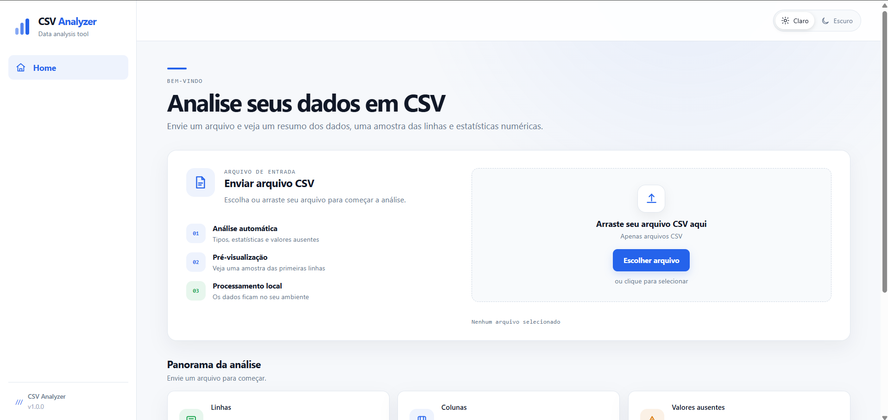

# CSV Analyzer

Aplicação full-stack para análise de arquivos CSV, desenvolvida com **backend em C** e **frontend em React + TypeScript**.

O usuário envia um arquivo CSV pela interface web e recebe uma análise automática contendo informações sobre estrutura, tipos de dados, valores ausentes, estatísticas numéricas e uma pré-visualização dos registros.

---

## Preview



---

## Funcionalidades

- Upload de arquivos CSV
- Drag & drop
- Validação de arquivos
- Detecção automática dos tipos das colunas
- Contagem de valores ausentes
- Estatísticas numéricas:
  - mínimo
  - máximo
  - média
- Pré-visualização das primeiras linhas
- API HTTP para comunicação entre frontend e backend
- Tratamento de erros da API
- Interface responsiva
- Tema claro e escuro
- Testes automatizados do analisador CSV

---

## Arquitetura

O projeto é dividido em duas partes principais:

```text
┌──────────────────────┐
│      React + TS      │
│       Frontend       │
└──────────┬───────────┘
           │
           │ HTTP
           │ POST /api/analyze
           ▼
┌──────────────────────┐
│      C Backend       │
│    libmicrohttpd     │
└──────────┬───────────┘
           │
           ▼
┌──────────────────────┐
│      CSV Analyzer    │
│                      │
│  • Parsing           │
│  • Type detection    │
│  • Missing values    │
│  • Numeric stats     │
│  • Data preview      │
└──────────────────────┘
```

---

## Tecnologias

### Backend

- C
- GCC
- libmicrohttpd
- cJSON
- Make
- Testes automatizados em C

### Frontend

- React
- TypeScript
- Vite
- SCSS
- HTML5
- CSS3

### Ferramentas

- Git
- GitHub
- VS Code
- MSYS2 UCRT64

---

## Estrutura do projeto

```text
csv-analyzer/
│
├── backend/
│   ├── include/
│   ├── src/
│   ├── tests/
│   ├── Makefile
│   └── README.md
│
├── frontend/
│   ├── src/
│   │   ├── components/
│   │   ├── services/
│   │   ├── styles/
│   │   ├── types/
│   │   ├── App.tsx
│   │   └── main.tsx
│   ├── package.json
│   └── vite.config.ts
│
├── docs/
│   ├── architecture.md
│   └── preview.png
│
├── .gitignore
├── LICENSE
└── README.md
```

---

## API

### Health check

```http
GET /api/health
```

Resposta:

```json
{
  "status": "ok"
}
```

### Analisar CSV

```http
POST /api/analyze
Content-Type: multipart/form-data
```

O arquivo deve ser enviado no campo:

```text
file
```

Exemplo de resposta:

```json
{
  "status": "ok",
  "filename": "data.csv",
  "rows": 3,
  "columns": 4,
  "column_names": [
    "nome",
    "idade",
    "salario",
    "ativo"
  ],
  "column_types": [
    "string",
    "integer",
    "float",
    "boolean"
  ],
  "missing_values": [
    0,
    1,
    0,
    0
  ],
  "numeric_stats": [
    null,
    {
      "minimum": 21,
      "maximum": 30,
      "average": 25.5
    },
    {
      "minimum": 3500.5,
      "maximum": 5100.75,
      "average": 4267.083333333333
    },
    null
  ],
  "preview": [
    [
      "Ramon",
      "21",
      "3500.50",
      "true"
    ]
  ]
}
```

---

## Backend

### Requisitos

Para executar o backend localmente, são necessários:

- GCC
- Make ou mingw32-make
- pkg-config
- libmicrohttpd
- cJSON

### Compilar

Entre no diretório do backend:

```bash
cd backend
```

Execute:

```bash
mingw32-make
```

### Executar

```bash
mingw32-make run
```

O servidor será iniciado na porta:

```text
8080
```

A API estará disponível em:

```text
http://localhost:8080
```

Health check:

```text
http://localhost:8080/api/health
```

---

## Testes

O backend possui uma suíte de testes para validar o comportamento do analisador CSV.

Os testes cobrem:

- análise básica de CSV
- detecção de tipos
- valores ausentes
- estatísticas numéricas
- pré-visualização
- limite da pré-visualização
- arquivos vazios
- campos vazios no final das linhas

Para executar:

```bash
mingw32-make test
```

Resultado esperado:

```text
[PASS] basic csv
[PASS] type detection
[PASS] missing values
[PASS] numeric statistics
[PASS] preview
[PASS] preview limit
[PASS] empty csv
[PASS] trailing empty fields
All tests passed.
```

---

## Frontend

### Requisitos

- Node.js
- npm

Entre no diretório:

```bash
cd frontend
```

Instale as dependências:

```bash
npm install
```

### Ambiente de desenvolvimento

Execute:

```bash
npm run dev
```

O Vite iniciará o frontend normalmente em:

```text
http://localhost:5173
```

Durante o desenvolvimento, as requisições para `/api` são encaminhadas para o backend C:

```text
http://127.0.0.1:8080
```

### Build de produção

```bash
npm run build
```

---

## Fluxo da aplicação

```text
1. Usuário seleciona um arquivo CSV
          ↓
2. React recebe o arquivo
          ↓
3. Frontend envia POST /api/analyze
          ↓
4. Vite encaminha a requisição
          ↓
5. Backend C recebe o arquivo
          ↓
6. CSV é processado
          ↓
7. Analyzer identifica tipos e calcula métricas
          ↓
8. Backend gera uma resposta JSON
          ↓
9. React recebe os dados
          ↓
10. Interface apresenta os resultados
```

---

## Análise realizada

Para cada arquivo enviado, o backend pode identificar:

### Estrutura

- quantidade de linhas
- quantidade de colunas
- nomes das colunas

### Tipos

- `string`
- `integer`
- `float`
- `boolean`

### Valores ausentes

A aplicação identifica campos vazios e contabiliza a quantidade de valores ausentes por coluna.

### Estatísticas numéricas

Para colunas numéricas são calculados:

- mínimo
- máximo
- média

### Pré-visualização

A aplicação retorna uma amostra das primeiras linhas do arquivo para visualização no frontend.

---

## Interface

A interface foi construída com foco em uma experiência simples para análise de arquivos CSV.

Principais características:

- layout responsivo
- drag & drop
- estados de carregamento
- mensagens de erro
- cards de métricas
- tabela de pré-visualização
- estatísticas numéricas
- tema claro
- tema escuro

---

## Objetivo do projeto

O CSV Analyzer foi desenvolvido como um projeto prático de integração entre um **backend de baixo nível escrito em C** e uma **aplicação web moderna**.

O projeto busca demonstrar conhecimentos em:

- programação em C
- processamento e parsing de arquivos
- criação de uma API HTTP
- comunicação frontend/backend
- serialização JSON
- desenvolvimento com React
- TypeScript
- SCSS
- testes automatizados
- Git e GitHub
- organização de uma aplicação full-stack

A proposta é manter uma arquitetura simples e funcional, sem adicionar complexidade desnecessária ao projeto.

---

## Possíveis evoluções

Algumas funcionalidades podem ser adicionadas futuramente:

- gráficos para dados numéricos
- filtros e ordenação da pré-visualização
- exportação dos resultados
- suporte a outros formatos de dados

Essas funcionalidades não fazem parte da versão atual.

---

## Licença

Este projeto está disponível sob a licença MIT.
